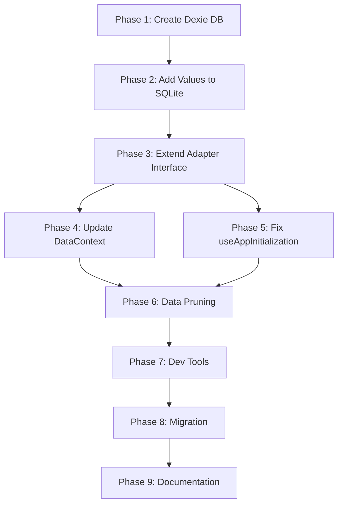

# Dexie Migratio

n & Schema v8 Implementation Plan

## Current State Analysis

**Key Findings:**

- Dexie.js v4.2.1 is installed but NOT used - code uses raw IndexedDB API
- Two storage paths: IndexedDB (LegacyAdapter) and SQLite (EncryptedAdapter for HIPAA)
- Schema v8 exists in IndexedDB code but:
- Values/goals methods not exposed via DatabaseAdapter interface
- SQLite schema missing `values_encrypted` table
- DataContext bypasses adapter, calls dbService directly
- Data persistence gaps: values/goals not properly saved/loaded

## Implementation Strategy

### Architecture Decision

- **IndexedDB (non-encrypted)**: Use Dexie.js for performance
- **SQLite (encrypted/HIPAA)**: Keep EncryptedPWA, add values table
- **Adapter Pattern**: All operations go through DatabaseAdapter interface
- **Offline-First**: IndexedDB as primary storage layer

---

## Phase 1: Dexie Implementation for IndexedDB

### 1.1 Create Dexie Database Class

**File**: `src/services/dexieDB.ts` (new)

```typescript
import Dexie, { Table } from 'dexie';
import { Goal, LogEntry, AppSettings, FeelingLog } from '../types';

// Define interfaces matching schema v8
interface ValueRecord {
  id?: number;
  userId: string;
  valueId: string;
  active: boolean;
  priority: number;
  createdAt: string;
  updatedAt: string;
}

interface GoalRecord extends Goal {
  // Goal interface already has required fields
}

interface UserRecord {
  id: string;
  username: string;
  passwordHash: string;
  email: string;
  therapistEmails?: string[];
  termsAccepted: boolean;
  termsAcceptedDate?: string;
  createdAt: string;
  lastLogin?: string;
}

interface AppDataRecord {
  userId: string;
  data: {
    settings: AppSettings;
    logs: LogEntry[];
    goals: Goal[];
    values: string[];
    lcswConfig?: any;
  };
}

// ... other interfaces

class GroundedDB extends Dexie {
  users!: Table<UserRecord, string>;
  appData!: Table<AppDataRecord, string>;
  values!: Table<ValueRecord, number>;
  goals!: Table<GoalRecord, string>;
  feelingLogs!: Table<FeelingLog, string>;
  userInteractions!: Table<any, string>;
  sessions!: Table<any, string>;
  assessments!: Table<any, string>;
  reports!: Table<any, string>;
  resetTokens!: Table<any, string>;
  metadata!: Table<any, string>;
  ruleBasedUsageLogs!: Table<any, string>;

  constructor() {
    super('groundedDB');
    this.version(8).stores({
      users: 'id, username, email',
      appData: 'userId',
      values: '++id, userId, valueId, active, createdAt, [userId+active]',
      goals: 'id, userId, valueId, completed, createdAt',
      feelingLogs: 'id, timestamp, emotionalState, userId',
      userInteractions: 'id, timestamp, sessionId, type',
      sessions: 'id, startTimestamp, valueId, userId',
      assessments: 'id, userId, timestamp',
      reports: 'id, userId, timestamp',
      resetTokens: 'token, userId, expires',
      metadata: 'id, appId, platform',
      ruleBasedUsageLogs: 'id, timestamp, type'
    });
  }
}

export const db = new GroundedDB();
```

**Why Dexie:**

- Better performance (query optimization, bulk operations)
- TypeScript support with type-safe queries
- Simpler API than raw IndexedDB
- Better error handling and transaction management
- HIPAA-compliant (can add encryption layer)

### 1.2 Update LegacyAdapter to Use Dexie

**File**: `src/services/databaseAdapter.ts`

- Replace `DatabaseService` calls with Dexie operations
- Implement all CRUD operations using Dexie API
- Maintain backward compatibility with existing interface

**Key Methods to Update:**

- `getAppData()` → `db.appData.get(userId)`
- `saveAppData()` → `db.appData.put({ userId, data })`
- `getActiveValues()` → `db.values.where('[userId+active]').equals([userId, true]).sortBy('priority')`
- `setValuesActive()` → Bulk operations with `db.values.bulkPut()`
- `saveGoal()` → `db.goals.put(goal)`
- `getGoals()` → `db.goals.where('userId').equals(userId).toArray()`

---

## Phase 2: Add Values Table to SQLite Schema

### 2.1 Update EncryptedPWA Schema

**File**: `src/services/encryptedPWA.ts` (line 204-320)Add to `createSchema()` method:

```sql
CREATE TABLE IF NOT EXISTS values_encrypted (
  id INTEGER PRIMARY KEY AUTOINCREMENT,
  user_id TEXT NOT NULL,
  value_id TEXT NOT NULL,
  active INTEGER DEFAULT 1,
  priority INTEGER DEFAULT 0,
  created_at TEXT NOT NULL,
  updated_at TEXT NOT NULL
);

CREATE INDEX IF NOT EXISTS idx_values_user_active ON values_encrypted(user_id, active);
CREATE INDEX IF NOT EXISTS idx_values_user ON values_encrypted(user_id);
CREATE INDEX IF NOT EXISTS idx_values_value ON values_encrypted(value_id);
```


### 2.2 Implement Values Methods in EncryptedAdapter

**File**: `src/services/databaseAdapter.ts` (EncryptedAdapter class)Add methods:

- `getActiveValues(userId: string): Promise<string[]>`
- `setValuesActive(userId: string, valueIds: string[]): Promise<void>`
- `saveValue(userId: string, valueId: string, active: boolean, priority?: number): Promise<void>`

---

## Phase 3: Extend DatabaseAdapter Interface

### 3.1 Add Values/Goals Methods to Interface

**File**: `src/services/databaseAdapter.ts` (line 35-138)Add to `DatabaseAdapter` interface:

```typescript
// Values operations
getActiveValues(userId: string): Promise<string[]>;
setValuesActive(userId: string, valueIds: string[]): Promise<void>;
saveValue(userId: string, valueId: string, active: boolean, priority?: number): Promise<void>;

// Goals operations (if not already present)
saveGoal(goal: Goal): Promise<void>;
getGoals(userId: string): Promise<Goal[]>;
deleteGoal(goalId: string): Promise<void>;
```


### 3.2 Implement in Both Adapters

- **LegacyAdapter**: Use Dexie methods
- **EncryptedAdapter**: Use SQLite queries

---

## Phase 4: Update DataContext to Use Adapter Pattern

### 4.1 Replace Direct dbService Calls

**File**: `src/contexts/DataContext.tsx`**Current Issue**: DataContext calls `dbService` directly, bypassing adapter**Fix**:

- Import `getDatabaseAdapter` instead of `dbService`
- Replace all `dbService.*` calls with `adapter.*`
- Ensure adapter is initialized before use

**Changes:**

```typescript
// Before
import { dbService } from '../services/database';
await dbService.saveAppData(userId, {...});
await dbService.setValuesActive(userId, selectedValueIds);

// After
import { getDatabaseAdapter } from '../services/databaseAdapter';
const adapter = getDatabaseAdapter();
await adapter.saveAppData(userId, {...});
await adapter.setValuesActive(userId, selectedValueIds);
```


### 4.2 Update handleSelectionComplete

**File**: `src/contexts/DataContext.tsx` (line 171-173)Ensure values are saved via adapter when user confirms selection.---

## Phase 5: Fix Data Loading in useAppInitialization

### 5.1 Use Adapter for All Data Loading

**File**: `src/hooks/useAppInitialization.ts` (line 359-410)**Current Issue**: Loads from adapter but also calls `dbService.getActiveValues()` directly**Fix**:

- Remove direct `dbService` calls
- Use adapter methods exclusively:
- `adapter.getAppData(userId)`
- `adapter.getActiveValues(userId)` (after adding to interface)
- `adapter.getGoals(userId)` (after adding to interface)

---

## Phase 6: Add Data Pruning (12 Month Retention)

### 6.1 Create Pruning Service

**File**: `src/services/dataPruning.ts` (new)

```typescript
export class DataPruningService {
  async pruneOldData(userId: string, adapter: DatabaseAdapter): Promise<void> {
    const twelveMonthsAgo = new Date();
    twelveMonthsAgo.setMonth(twelveMonthsAgo.getMonth() - 12);
    const cutoffDate = twelveMonthsAgo.toISOString();

    // Prune feelingLogs older than 12 months
    const oldLogs = await adapter.getFeelingLogs(undefined, userId);
    const logsToDelete = oldLogs.filter(log => log.timestamp < cutoffDate);
    // Delete logic...

    // Prune userInteractions older than 12 months
    // Similar logic...
  }
}
```


### 6.2 Schedule Pruning

- Run on app initialization (background, non-blocking)
- Run weekly via service worker or scheduled task

---

## Phase 7: Add Developer Utilities

### 7.1 Create Database Inspector Component

**File**: `src/components/DatabaseInspector.tsx` (new)Features:

- List all object stores/tables
- Show record counts per store
- Export JSON dumps
- Clear/delete operations (dev only)
- Accessible via `/dev` route or hidden key combo

### 7.2 Add to App Router

**File**: `src/routes/AppRouter.tsx`Add dev route (only in development mode):

```typescript
{process.env.NODE_ENV === 'development' && view === 'dev' && (
  <DatabaseInspector />
)}
```

---

## Phase 8: Migration & Data Integrity

### 8.1 Migrate Existing Data to Dexie

**File**: `src/services/migrationService.ts` (extend)

- Detect existing IndexedDB data (raw API)
- Migrate to Dexie structure
- Verify data integrity
- Mark migration complete

### 8.2 Ensure Values/Goals Migration

- Existing appData.values → values table
- Existing appData.goals → goals table
- Run on first Dexie initialization

---

## Phase 9: Documentation

### 9.1 Create Persistence Documentation

**File**: `docs/persistence.md` (new)Contents:

- Schema reference (all 12 stores)
- Version history table
- File locations (dexieDB.ts, databaseAdapter.ts)
- Migration strategy
- Browser debugging tips (Chrome DevTools)
- HIPAA compliance notes

---

## Implementation Order & Dependencies



---

## Acceptance Criteria

1. ✅ Dexie.js implemented and replacing raw IndexedDB API
2. ✅ Values table exists in both IndexedDB (Dexie) and SQLite (EncryptedPWA)
3. ✅ Goals table properly implemented in both storage paths
4. ✅ DatabaseAdapter interface includes values/goals methods
5. ✅ DataContext uses adapter pattern (no direct dbService calls)
6. ✅ Data persists correctly across sessions
7. ✅ Migration from existing data works
8. ✅ Data pruning removes records older than 12 months
9. ✅ Developer utilities available for debugging
10. ✅ Documentation created in docs/persistence.md
11. ✅ HIPAA compliance maintained (encryption, audit logs)
12. ✅ Performance improved (Dexie optimizations)

---

## Risk Mitigation

- **Backward Compatibility**: Maintain adapter pattern to support both storage types
- **Data Loss Prevention**: Comprehensive migration with validation
- **Performance**: Dexie provides better query performance than raw IndexedDB
- **HIPAA Compliance**: Encryption layer remains intact, audit logs continue

---

## Testing Checklist

- [ ] Dexie database initializes correctly
- [ ] Values save/load from Dexie table
- [ ] Goals save/load from Dexie table
- [ ] Encrypted mode: values save/load from SQLite
- [ ] Data persists after browser refresh
- [ ] Migration from old data works